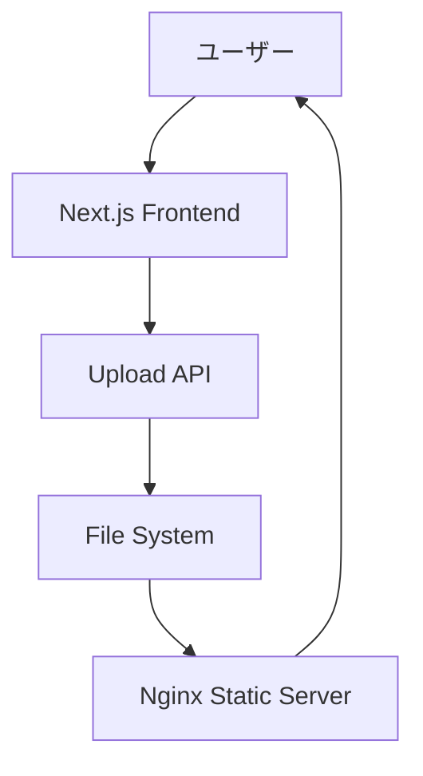

# 📁 Next.js File Upload System

> 🚀 **モダンで高機能なファイルアップロードアプリケーション**

Next.js 14 + TypeScript + Docker で構築された、プロダクションレディなファイルアップロードシステムです。直感的なドラッグ&ドロップUI、リアルタイムプレビュー、そして堅牢なファイル管理機能を提供します。

[](https://nextjs.org/)
[](https://www.typescriptlang.org/)
[](https://tailwindcss.com/)
[](https://www.docker.com/)
[](LICENSE)

## 🌟 特徴

### 🎯 核心機能
- **📤 ドラッグ&ドロップアップロード** - 直感的なファイル操作
- **🖼️ リアルタイムプレビュー** - アップロード後即座に確認
- **📱 完全レスポンシブ** - あらゆるデバイスで最適表示
- **⚡ 高速処理** - 最適化されたファイル処理エンジン

### 🛡️ セキュリティ & バリデーション
- **🔍 厳格なファイル検証** - 形式・サイズ・内容の多層チェック
- **🔒 安全なファイル名処理** - インジェクション攻撃対策
- **📏 サイズ制限** - 最大10MBまでの制御
- **🎭 MIME タイプ検証** - 偽装ファイル検出

### 💫 ユーザーエクスペリエンス
- **🎨 モダンダークUI** - 目に優しいデザイン
- **📋 ワンクリックURLコピー** - 即座に共有可能
- **🔄 プログレス表示** - アップロード状況をリアルタイム表示
- **❌ 詳細エラーフィードバック** - 分かりやすいエラーメッセージ

## 🖥️ スクリーンショット

```
┌─────────────────────────────────────────┐
│  📁 Next.js ファイルアップローダー        │
├─────────────────────────────────────────┤
│                                         │
│     📤 画像をドラッグ&ドロップ           │
│           または                        │
│      [📁 ファイルを選択]                │
│                                         │
│   対応: JPEG, PNG, GIF, WebP (10MB)     │
└─────────────────────────────────────────┘

┌─── アップロード済み画像 (3) ─────────────┐
│ [🖼️ image1.jpg] [🖼️ image2.png] [🖼️ ...] │
│ [🔗 URLコピー] [👁️ 拡大表示]              │
└─────────────────────────────────────────┘
```

## 🚀 クイックスタート

### 📋 システム要件

- **Docker** 20.0 以上
- **Docker Compose** 2.0 以上
- **RAM** 最小 1GB（推奨 2GB以上）

### ⚡ 30秒で起動

```bash
# 1. リポジトリクローン
git clone https://github.com/your-username/nextjs-file-upload.git
cd nextjs-file-upload

# 2. 一発起動
docker-compose up -d

# 3. アクセス
open http://localhost:3000
```

**🎉 完了！** すぐにファイルアップロードが可能です。

### 🌐 アクセスURL

| サービス | URL | 説明 |
|---------|-----|------|
| 🌐 **メインアプリ** | http://localhost:3000 | ファイルアップロード画面 |
| 📁 **ファイルサーバー** | http://localhost:8080/uploads/ | アップロード済みファイル |

## 🛠️ 技術仕様

### 🏗️ アーキテクチャ



### 📦 技術スタック

#### フロントエンド
- **🖼️ Framework**: Next.js 14.2.30 (App Router)
- **📝 Language**: TypeScript 5.0
- **🎨 Styling**: TailwindCSS 3.4.1
- **⚛️ Components**: Custom React Hooks & Components

#### バックエンド & インフラ
- **🔌 API**: Next.js API Routes (Edge Runtime)
- **💾 Storage**: Local File System (日付別階層化)
- **🌐 Web Server**: Nginx 1.25 (高速静的配信)
- **🐳 Container**: Docker + Docker Compose

#### 対応ファイル
- **📸 画像形式**: JPEG, PNG, GIF, WebP
- **📏 最大サイズ**: 10MB
- **🗂️ 保存形式**: `/uploads/images/YYYY/MM/DD/timestamp_filename`

## 📁 プロジェクト構造

```
nextjs-file-upload/
├── 📂 frontend/                    # Next.jsアプリケーション
│   ├── 📂 app/
│   │   ├── 📂 api/upload/          # ファイルアップロードAPI
│   │   ├── 📂 components/          # Reactコンポーネント
│   │   ├── 📂 types/               # TypeScript型定義
│   │   ├── layout.tsx              # アプリレイアウト
│   │   ├── page.tsx                # ホームページ
│   │   └── globals.css             # グローバルスタイル
│   ├── 📄 Dockerfile               # フロントエンド用Docker設定
│   ├── 📄 next.config.mjs          # Next.js設定
│   ├── 📄 tailwind.config.ts       # TailwindCSS設定
│   ├── 📄 package.json             # 依存関係
│   └── 📄 README.md                # フロントエンド開発者向けドキュメント
├── 📂 nginx/                       # Webサーバー設定
│   ├── 📄 Dockerfile               # Nginx用Docker設定
│   ├── 📄 nginx.conf               # Nginx設定ファイル
│   └── 📄 README.md                # インフラエンジニア向けドキュメント
├── 📂 shared-uploads/              # アップロードファイル保存先
│   └── 📂 images/                  # 画像ファイル（日付別）
├── 📄 compose.yml                  # Docker Compose設定
├── 📄 LICENSE                      # MITライセンス
└── 📄 README.md                    # このファイル
```

## ⚙️ 設定とカスタマイズ

### 🔧 システム設定

各コンポーネントの詳細設定については、それぞれのREADMEをご確認ください：

- **フロントエンド設定**: [frontend/README.md](frontend/README.md)
- **Nginx設定**: [nginx/README.md](nginx/README.md)

### 📊 主要設定項目

| 項目 | 設定ファイル | 説明 |
|------|-------------|------|
| **アップロードサイズ制限** | `frontend/app/api/upload/route.ts` | 最大10MB |
| **対応ファイル形式** | `frontend/app/api/upload/route.ts` | JPEG, PNG, GIF, WebP |
| **静的ファイル配信** | `nginx/nginx.conf` | CORS・キャッシュ設定 |
| **ポート設定** | `compose.yml` | フロントエンド:3000, Nginx:8080 |

## 🚀 開発ガイド

### 💻 開発環境選択

**🐳 Docker開発（推奨）**
```bash
# システム全体を起動
docker-compose up -d

# ログ確認
docker-compose logs -f
```

**⚡ ローカル開発**
```bash
# フロントエンドのみローカル実行
cd frontend
npm install
npm run dev

# 別ターミナルでNginx起動
docker-compose up nginx
```

### 🧪 利用可能なコマンド

```bash
# 🐳 Docker操作
docker-compose up -d              # バックグラウンド起動
docker-compose up --build         # 再ビルドして起動
docker-compose down               # 停止・削除
docker-compose logs -f            # ログ表示
docker-compose restart <service>  # サービス再起動

# 🔍 デバッグ
docker-compose ps                 # サービス状態確認
docker-compose exec <service> sh  # コンテナ内部アクセス
```

## 📖 API仕様

### `POST /api/upload`

ファイルアップロード用エンドポイント

#### リクエスト
```http
POST /api/upload HTTP/1.1
Content-Type: multipart/form-data

------WebKitFormBoundary
Content-Disposition: form-data; name="file"; filename="image.jpg"
Content-Type: image/jpeg

[バイナリデータ]
------WebKitFormBoundary--
```

#### レスポンス（成功）
```json
{
  "success": true,
  "imageUrl": "/uploads/images/2025/06/18/1718634567890_image.jpg",
  "filename": "image.jpg",
  "size": 1048576
}
```

#### レスポンス（エラー）
```json
{
  "success": false,
  "error": "ファイルサイズは10MB以下にしてください"
}
```

#### エラーコード
| コード | 説明 |
|-------|------|
| `400` | ファイル未選択、形式不正、サイズ超過 |
| `500` | サーバー内部エラー |

## 🛡️ セキュリティ

### 🔒 実装済みセキュリティ対策

- ✅ **ファイル形式検証** - MIMEタイプチェック
- ✅ **ファイルサイズ制限** - 10MB上限
- ✅ **ファイル名サニタイズ** - 特殊文字除去
- ✅ **パストラバーサル対策** - ディレクトリ固定
- ✅ **CORS設定** - オリジン制御
- ✅ **エラー情報制限** - 内部情報の非公開

### 🔍 セキュリティチェックリスト

本番運用前に確認してください：

- [ ] アップロードディレクトリの権限設定
- [ ] Nginxアクセスログの監視設定
- [ ] ファイルスキャン（ウイルス対策）の実装
- [ ] レート制限の設定
- [ ] HTTPS化（SSL証明書）
- [ ] 定期的なログローテーション

## 🚨 トラブルシューティング

### よくある問題と解決法

#### 🔴 ポート競合エラー
```bash
Error: bind: address already in use
```
**解決法:**
```bash
# 使用中のポート確認
sudo netstat -tulpn | grep :3000
sudo netstat -tulpn | grep :8080

# プロセス終了
sudo kill -9 <PID>

# または compose.yml でポート変更
```

#### 🔴 アップロード権限エラー
```bash
Error: EACCES: permission denied
```
**解決法:**
```bash
# ディレクトリ権限修正
sudo chown -R $USER:$USER shared-uploads/
chmod -R 755 shared-uploads/

# SELinux環境の場合
sudo setsebool -P httpd_can_network_connect 1
```

#### 🔴 ファイルが表示されない
**原因と解決法:**
1. **Nginxサーバー未起動**
   ```bash
   docker-compose ps
   docker-compose up nginx
   ```

2. **ファイルパス不正**
   ```bash
   ls -la shared-uploads/images/
   ```

3. **CORS問題**
   ```bash
   # nginx/nginx.conf の CORS設定を確認
   docker-compose exec nginx nginx -T | grep -i cors
   ```

#### 🔴 Docker関連エラー
```bash
# 完全クリーンアップ
docker-compose down -v
docker system prune -a

# 再構築
docker-compose up --build
```

### 🔍 ログ分析

```bash
# システム全体のログ
docker-compose logs -f --tail=100

# 特定サービスのログ
docker-compose logs -f nextjs-app
docker-compose logs -f nginx

# エラーログ抽出
docker-compose logs 2>&1 | grep -i error
```

## 🔄 デプロイ

### 🌐 本番環境デプロイ

1. **環境変数設定**
   ```bash
   # .env.production 作成
   NEXTJS_URL=https://yourdomain.com
   NODE_ENV=production
   ```

2. **HTTPS対応**
   ```yaml
   # compose.yml に SSL設定追加
   nginx:
     volumes:
       - ./ssl:/etc/nginx/ssl
   ```

3. **ドメイン設定**
   ```nginx
   # nginx/nginx.conf 更新
   server_name yourdomain.com;
   ```

### ☁️ クラウドデプロイ

- **Docker Hub**: `docker push your-repo/nextjs-file-upload`
- **AWS ECS**: `ecs-cli compose up`
- **Google Cloud Run**: `gcloud run deploy`
- **Azure Container Instances**: `az container create`

## 🤝 コントリビューション

貢献を歓迎します！以下の手順でお願いします：

### 📝 開発フロー

1. **Issue作成** - バグ報告や機能提案
2. **フォーク** - このリポジトリをフォーク
3. **ブランチ作成** - `git checkout -b feature/awesome-feature`
4. **開発** - コード作成とテスト
5. **コミット** - `git commit -m '✨ Add awesome feature'`
6. **プッシュ** - `git push origin feature/awesome-feature`
7. **PR作成** - プルリクエストを作成

### 🎯 貢献ガイドライン

- **コード品質**: ESLint + Prettier に準拠
- **コミットメッセージ**: [Conventional Commits](https://conventionalcommits.org/) 形式
- **テスト**: 新機能には必ずテストを追加
- **ドキュメント**: README や型定義の更新

### 🏷️ コミット例

```bash
git commit -m "✨ feat: ドラッグ&ドロップ複数ファイル対応"
git commit -m "🐛 fix: ファイルサイズ制限バグ修正"
git commit -m "📚 docs: API仕様書更新"
git commit -m "🎨 style: UIコンポーネント改善"
git commit -m "⚡ perf: Nginx設定最適化"
```

## 📞 サポート

### 🆘 ヘルプが必要な場合

- **🐛 バグ報告**: [Issues](https://github.com/your-username/nextjs-file-upload/issues) を作成
- **💡 機能提案**: [Discussions](https://github.com/your-username/nextjs-file-upload/discussions) で議論
- **❓ 質問**: [Q&A セクション](https://github.com/your-username/nextjs-file-upload/discussions/categories/q-a)

### 📚 参考資料

- [Next.js Documentation](https://nextjs.org/docs)
- [TypeScript Handbook](https://www.typescriptlang.org/docs/)
- [TailwindCSS Documentation](https://tailwindcss.com/docs)
- [Docker Compose Reference](https://docs.docker.com/compose/)
- [Nginx Documentation](https://nginx.org/en/docs/)

## 📄 ライセンス

このプロジェクトは [MIT License](LICENSE) の下で公開されています。

```
MIT License - 商用利用、複製、配布、修正すべて自由に行えます
```

## 🙏 謝辞

このプロジェクトの開発にご協力いただいた皆様に感謝いたします。

---

<div align="center">

**⭐ このプロジェクトが役に立った場合は、スターを付けていただけると嬉しいです！**

Made with ❤️ by [k-sugawara](https://github.com/k-sugawara)

</div>